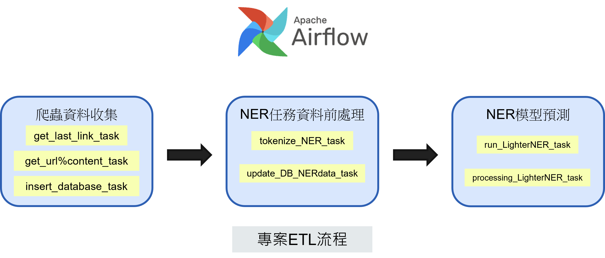
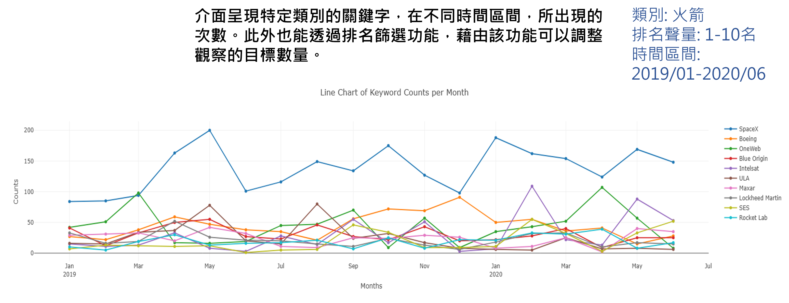
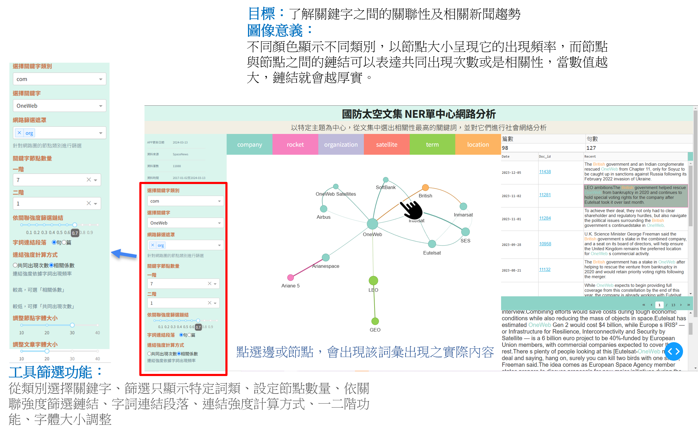

# 太空文集資料視覺化

### 資料來源
- https://spacenews.com/(Commercial, Opinion) 

###　專案目標
- 自動化國防新聞監控平台，使得分析工具能保持在最新的趨勢

### 分析流程
- 透過Airflow，自動化ETL流程，產生分析資料
- 透過命名實體辨識Named Entity Recognition (NER) 任務自動辨識重要的技術、公司、組織、衛星等關鍵字。

### 分析框架
- Python、PlotDash

### NER模型方法
- https://aclanthology.org/2022.coling-1.209/
- Pretraining Dataset: CoNLL-2003 (Sang & De Meulder, 2003), Label：location、person、organization、others  
- Few-show Dataset:人工標註文章(50篇)，company、location、rocket、satelite、organization、term 

### 視覺化應用使用說明

1. 可先藉由關鍵字聲量趨勢、排名資料視覺化應用，觀察各類別關鍵字，了解期間之趨勢變化，並從中找尋感興趣之公司、組織、技術之目標關鍵字
2. 接著透過網路圖視覺化應用，觀察目標關鍵字與其他關鍵字之關聯性後，透過互動式功能點按節點或鏈，來取得目標新聞案例

藉由右側的句子、文章窗口來了解目標關鍵字  
- SoftBank撤資
- British入主OneWeb 
- 與Eutelsat合併，整合GEO與LEO的資源
- Hughes提供網關設備
